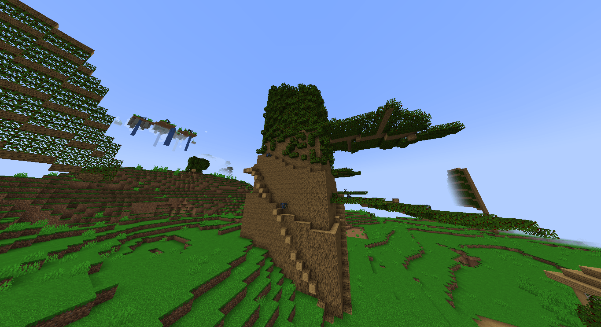

# 🛠️ Mod Minecraft — Expansão Inspirada no Orespawn (1.20.1)

## 📝 Descrição do Projeto

Este é um **mod para Minecraft 1.20.1** inspirado no lendário mod **Orespawn**, trazendo **mecânicas diferentes** e uma variedade de **novos conteúdos**, como:

- ⚔️ Armaduras e armas exclusivas  
- 🧱 Blocos únicos e funcionais  
- 👾 Novos mobs e criaturas personalizadas  
- 🌀 Diversas mecânicas inovadoras

O objetivo é criar uma expansão divertida e original para as versões mais recentes do Minecraft, com foco na criatividade e inovação.

---

## 📦 Requisitos

Este mod **requer obrigatoriamente** a instalação da biblioteca [**GeckoLib**](https://cursemaven.com/#software.bernie.geckolib:geckolib-forge-1.20.1) compatível com a versão **1.20.1**.

> ⚠️ Sem o GeckoLib, o mod **não funcionará corretamente**.

---

## 👨‍💻 Sobre o Desenvolvimento

- Desenvolvido **inteiramente por uma única pessoa**, utilizando a ferramenta [**MCreator**](https://mcreator.net/).
- O desenvolvimento é feito no tempo livre, então **as atualizações podem demorar um pouco** para serem lançadas.
- Tenho **muitas ideias planejadas**, então este mod está longe de estar finalizado!  
  **Por favor, tenha paciência e acompanhe a evolução do projeto!** 😄

---

## 📸 Imagem do Mod

  

---

## 🚧 Status do Projeto

🔨 **Em desenvolvimento** — versão inicial com recursos básicos já implementados.  
📅 **Atualizações futuras planejadas com mais conteúdos, mobs, biomas e mecânicas**.

---

## 📬 Contato e Feedback

Sinta-se à vontade para deixar sugestões, ideias ou bugs na aba de **Issues** ou diretamente pelos comentários do repositório!  
Toda ajuda é bem-vinda para melhorar o mod. 💬

---
